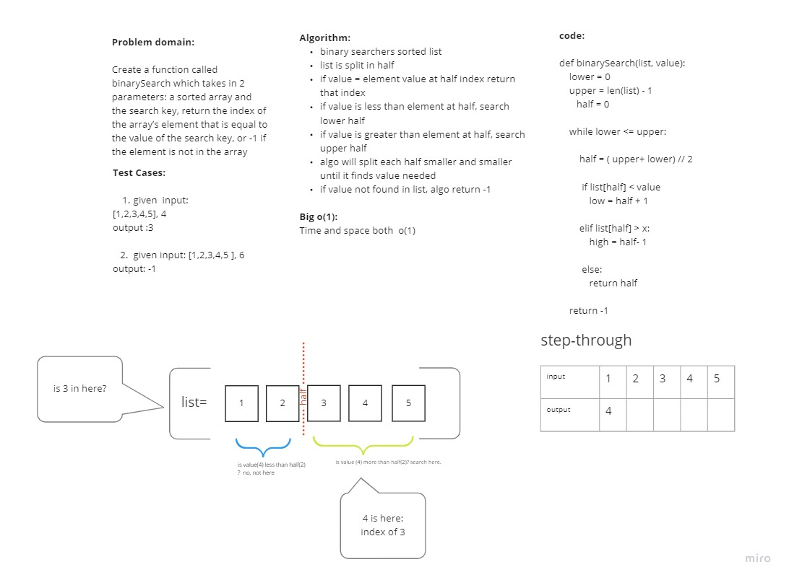

# Binary Search
Create a function called binarySearch which takes in 2 parameters: a sorted array and the search key, return the index of the array’s element that is equal to the value of the search key, or -1 if the element is not in the array
## Whiteboard Process

## Approach & Efficiency
Time and Space is O(1). We search for the given number using a binary search. This allows us to solve the task at hand by breaking it down into smaller blocks, searching smaller blocks over time. This keeps effieciency at O(1).

## Solution
Create a function that searches for given value index. List is split in half using floor math. If x is greater than element at half index, ignore lower half. I value is smaller than upper half, ignore upper half. keep searching until value is at halfway point, return index. If value is not in list, return -1

