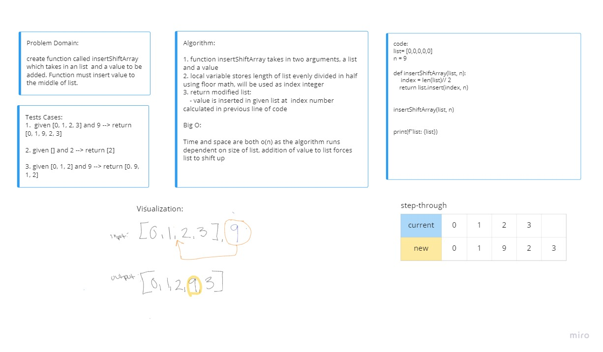

# Insert to Middle of an Array
Create a function that inserts  and shifts an element to the middle index of a list.

## Whiteboard Process

## Approach & Efficiency
Lists always even when empty have an index number. I decided to find the length of given list and divide that in half using the floor math method. I used that result as the index integer when using the insert method to my modify my existing list and add a value to it.

