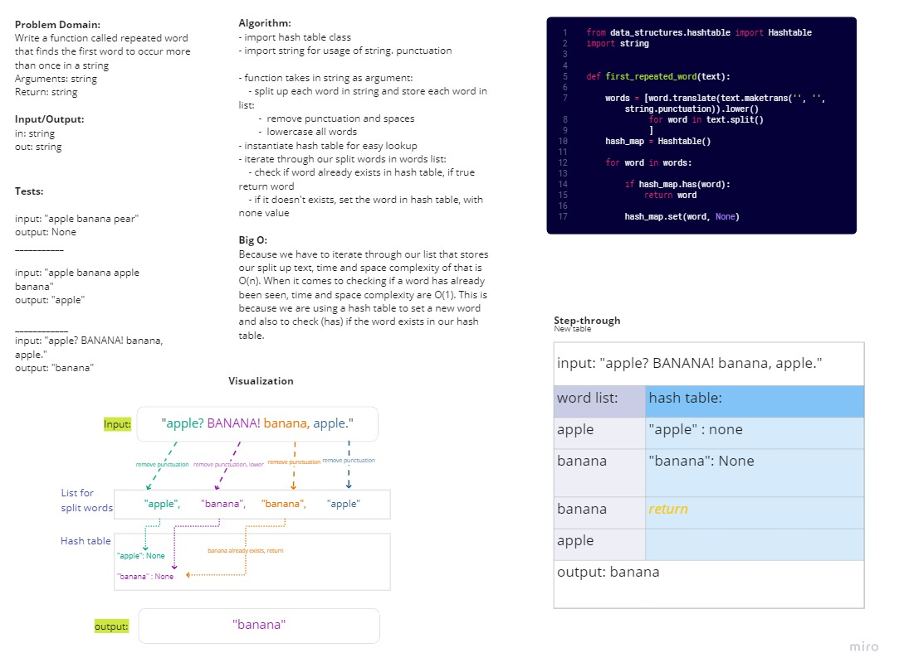

# Hashtable Repeated Word 
Practice in using hashtables and their effiency for looking up a key value pair. 
## Challenge
Write a function called repeated word that finds the first word to occur more than once in a string
- Arguments: string
- Return: string

## Approach & Efficiency
Because we have to iterate through our list that stores our split up text, time and space complexity of that is O(n). When it comes to checking if a word has already been seen, time and space complexity are O(1). This is because we are using a hash table to set a new word and also to check (has) if the word exists in our hash table.

## Whiteboard

