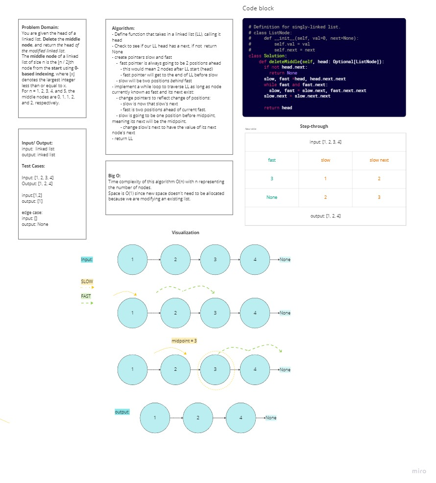
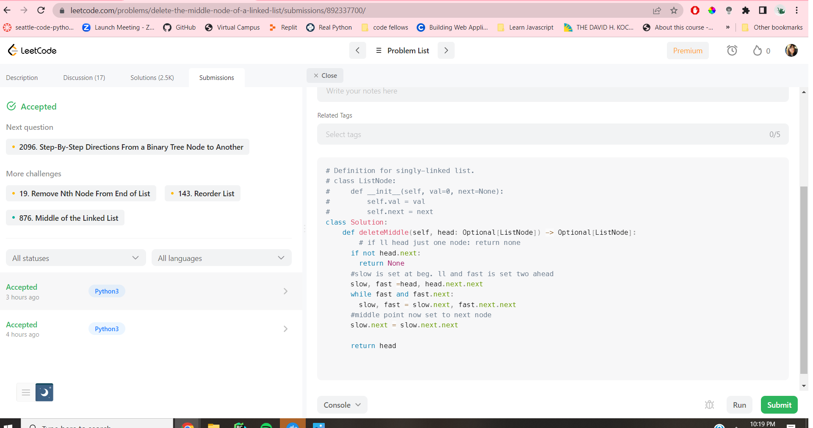

# Leet Code: Delete the Middle Node of a Linked List
 challenge to modify a linked list by deleting the node positioned in the middle of linked list.  

## Challenge
You are given the head of a linked list. Delete the middle node, and return the head of the modified linked list.

The middle node of a linked list of size n is the ⌊n / 2⌋th node from the start using 0-based indexing, where ⌊x⌋ denotes the largest integer less than or equal to x.

For n = 1, 2, 3, 4, and 5, the middle nodes are 0, 1, 1, 2, and 2, respectively.

Input: head = [1,3,4,7,1,2,6]
Output: [1,3,4,1,2,6]
Explanation:
The above figure represents the given linked list. The indices of the nodes are written below.
Since n = 7, node 3 with value 7 is the middle node, which is marked in red.
We return the new list after removing this node. 

## Whiteboard

## Approach & Efficiency
This algorithm runs with a time effiency of O(n) with n representing the nodes. Space is O(1) because no new space is being allocated. 
