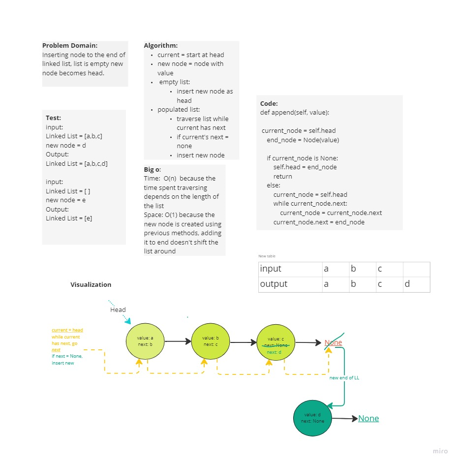

# Code Challenge 6. Linked List Insertions

## Author: Monica Ramirez

Setup
vevn to run test using pytest or pytest-watch

## initialization

code editor linked_list.py
activate virtual enviroment and run pytest + test files

## Tests
Test insertion of new node at the end of linked link. If list is empty, new node will become head of linked list. 

## How do you run tests?
run pytest watch in virtual enrioment with this file: tests/code_challenges/test_linked_list_insertions.py

## Any tests of note?
skipped test for insert before and insert after, functions incomplete
