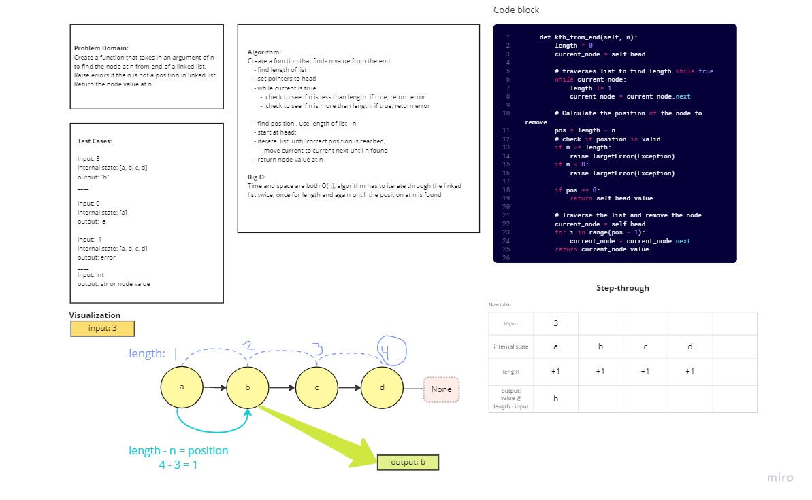

# Singly Linked List
Challenge was to add on on to linked_list.py, adding a method that returns node from kth(2nd from, 3rd from last etc) of end of list.

## Challenge
Create a method that returns a value at kth place from end of linked list:
  - argument: int
  - returns value at int position

## Whiteboard

## Approach & Efficiency
Time is of O(n), the list is traversed twice. Once to find lenght and a second time to find the kth value in our list.

## Solution

Traverse list to find lenght of linked list. Use linked list lenght and subtract target value (argument). Traverse list until target position reached, return value at target position. 
