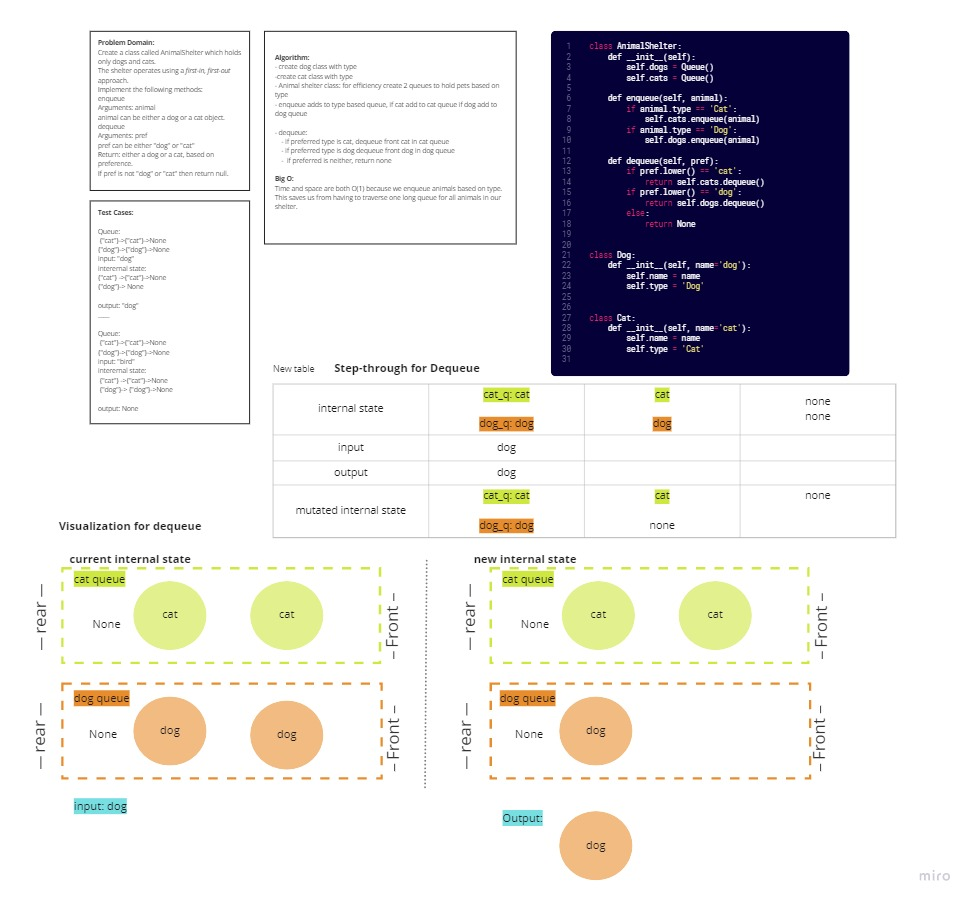

# Stacks and Queues Animal Shelter

## Challenge
Create an animal class that has methods that enqueues animals and deques animals to shelter. Shelter only contains cat or dog types, if user is asking for any other animal return none. 
## Whiteboard Process 

## Approach & Efficiency
Both class methods run in constant time (Big O(1)), staying efficient. This was possible because animals were placed in queues based on type to elimintate unecessary traversing of the queue. 
## Solution:
Create two queues for each type of animal to elimnate unecessary traversling of a sinlgle queue. Enqueue animal to respective animal queue and dequeue preffered animal based on input. 
[Two queues](https://github.com/mramirez92/data-structures-and-algorithms/blob/main/python/code_challenges/stack_queue_animal_shelter.py)
```
  shelter = AnimalShelter()
   cat = Cat()
   
   expected: cat
```
