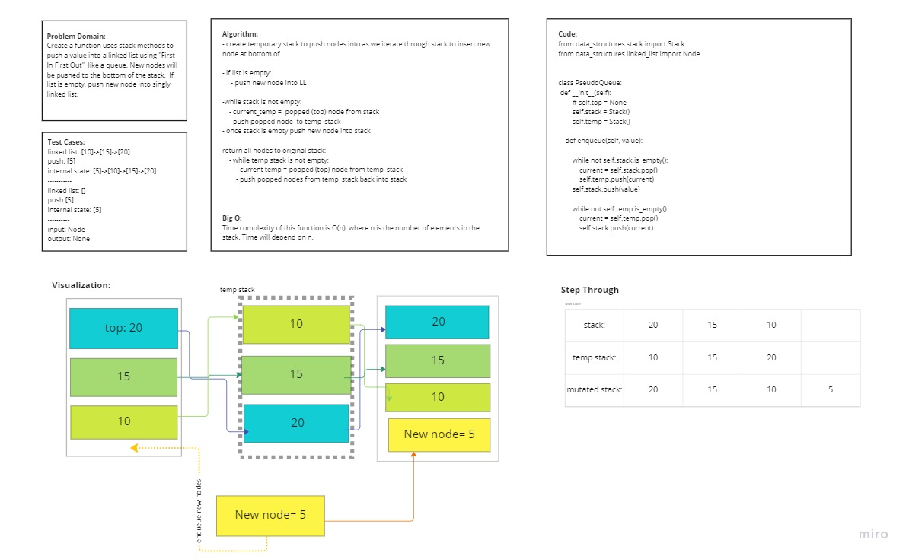

# Stack Queue Pseudo 

Create a new class called pseudo queue.
PseudoQueue class will implement our standard queue interface (the two methods listed below). Internally, utilize 2 Stack instances to create and manage the queue
- Methods:
   - `enqueue`
    - Arguments: value
    - Inserts a value into the PseudoQueue, using a first-in, first-out approach.
  - dequeue
    - Arguments: none
    - Extracts a value from the PseudoQueue, using a first-in, first-out approach.

## Whiteboard Process

## Approach & Efficiency
Because we are using stack methods to create a queue (front and rear) our method needs to be able to instantiate new nodes and push them to the bottom of stack. We do this by creating a temporary holding stack. Nodes are popped off our original stack and pushed to this temporary stack. 
This will allow us to push the new node to our original empty stack. We then move our original stack from the back temporary stack. Because of all the stack manipulation, this algorightm has a time complexity of O(n). Time is dependent on the amount of nodes in our stack. 
