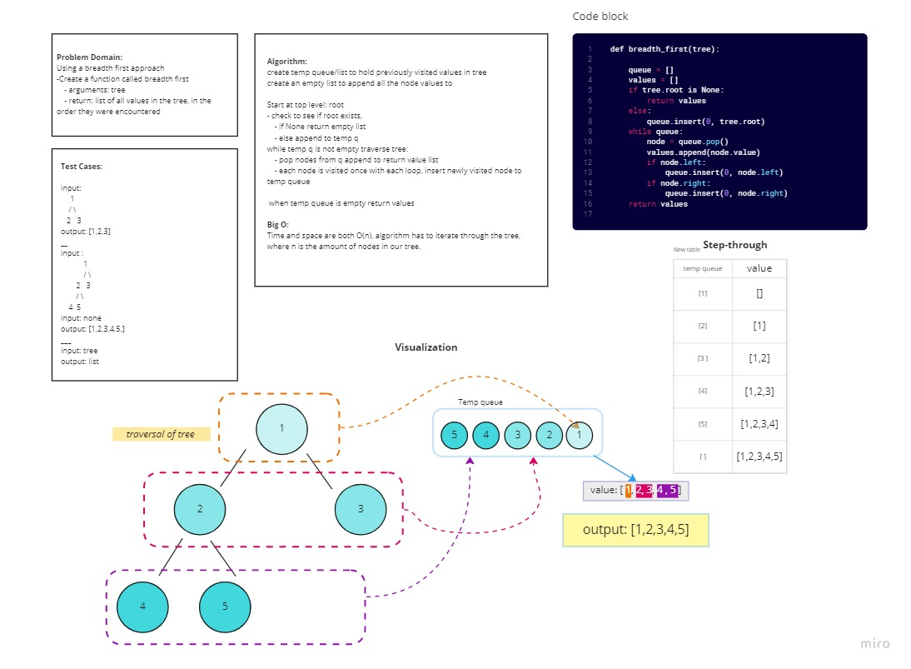

# Tree-Breadth-First
Implementation of tree traversal using a breadth-first method.

Author: Monica Ramirez

## Challenge
Write a function called breadth first
- Arguments: tree
- Return: list of all values in the tree, in the order they were encountered
- Use BFS 

## Whiteboard

## Approach & Efficiency

Big O notation for this method depends on the tree height and number of nodes, because of this the find_maximum_value method functions at O(n). 

##Solution:
To traverse the tree in a breadth-first method a temporary queue (list) was created to house the most recently visited node in our tree. The tree will be traversed as long as this temp queue is not empty. 
Each iteration of the loop will see the node in queue popped off and added to our value list. Each iterations will visit one node at a time until the queue is empty, meaning no new nodes were added. The list of list holding all of the node values will be returned. 
