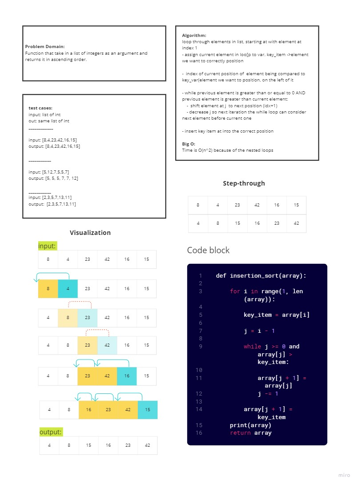

# Blog Notes: Insertion Sort

Author: Monica Ramirez

## Challenge
Write a function that takes in a list of integers as input and returns the list in ascending order. 

## Whiteboard

## Approach & Efficiency

Big O notation for this method is O of n^2 because it has to loop twice. 

## Solution

Loop through list, if elements previous to the element needing placement, shift placing element to the right. 

## Resources
[RealPython](https://realpython.com/sorting-algorithms-python/#analyzing-the-strengths-and-weaknesses-of-insertion-sort)
[w3schools](https://www.geeksforgeeks.org/insertion-sort/)
