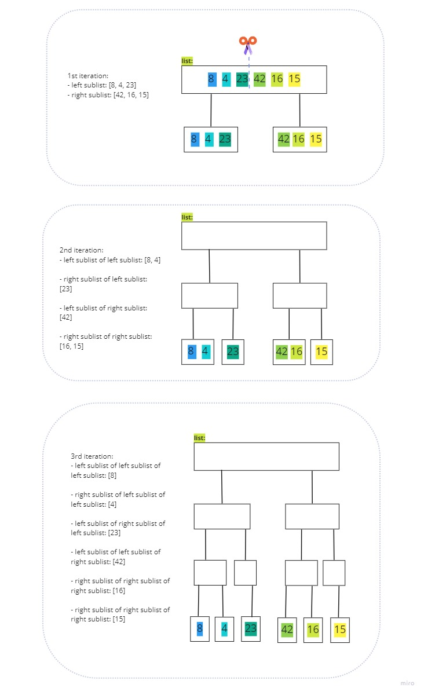
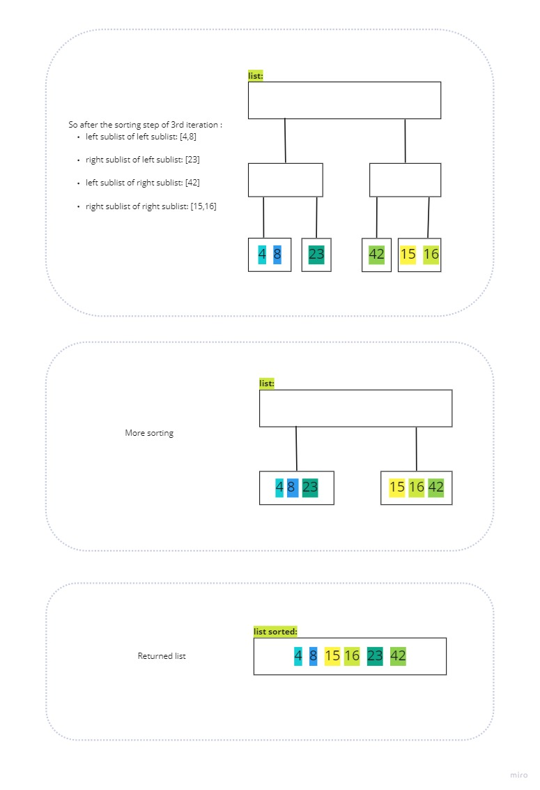

# Blog Notes: Merge Sort

The merge and sort code is a sorting algorithm that takes in an unsorted list of elements and returns a sorted version of that list. Think of it as a "divide and conquer" way of sorting. The list given as an argument is divided into smaller sublists. Each sublist is then sorted and at the end, the sorted sublists are merged. The sorted sublist is then returned. 

In this code, we will be using a `merge()` helper function to merge the sublists into one sorted list. 

Here's the code in its entirety:

```Python
def merge_sort(lst):  
    n = len(lst)  
  
    if n > 1:  
        mid = n // 2  
        left = lst[:mid]  
        right = lst[mid:]  
  
        merge_sort(left)  
        merge_sort(right)  
        merge(left, right, lst)  
    return lst  
  
  
def merge(left, right, lst):  
    i = 0  
    j = 0  
    k = 0  
  
    while i < len(left) and j < len(right):  
        if left[i] <= right[j]:  
            lst[k] = left[i]  
            i += 1  
        else:  
            lst[k] = right[j]  
            j += 1  
        k += 1  
  
    if i == len(left):  
        lst[k:] = right[j:]  
    else:  
        lst[k:] = left[i:]
```
  
`merge_sort` function: 
- Takes in a list as input `merge_sort(lst)`
- Length of the list is assigned to `n`
- If `n` is greater than 1, the list is split in half
	- Middle index is found with `mid =n//2`, creating two halves with elements before and after `mid` stored in `left` and `right`, respectively
	- `merge_sort` recursively calls itself on `left` and `right`, creating smaller and smaller sublists as long as `n` (length of the list) is greater than one.
	- The merge helper function is called with the sorted `left` and `right` lists and original `lst` as inputs. 
- Sorted `lst` is returned

`merge` function:
- Takes in three inputs: sorted lists `left` and `right`, and a list `lst` which will be used to store our final sorted result. 
- Three variables `i`, `j`, and `k` are initialized at 0.
	- Both `i` and `j` are used to keep track of the current position in `left` and `right`, respectively
	- `k` is used to keep track of the current position in `lst`
- The while loop will iterate as long as `left` and `right` contain elements. 
	- Current positions at `left` (`i`) and `right` (`j`) are compared
	- The smaller element of the two is appended to the current position in `lst` (`k`)
	- Current position `k` in our `lst` is incremented by one to allow for the next comparison
	- After the while loop, one of the lists will be exhausted and the remaining elements of the other list will be appended to `lst`

Let's walk through each step with a visualization to see how all of this comes together to return our sorted list. 

```Python
my_list = [ 8, 4, 23, 42, 16, 15 ]
merge_sort(my_list)
```

The length of our list is 6, which is greater than one. Our list will be divided into two halves: `left` and `right`.




And thats it our returned list should look like this `[4, 8, 15, 16, 23, 42]`.

You can find the code [here](https://github.com/mramirez92/data-structures-and-algorithms/blob/main/python/code_challenges/mergesort.py) and testing files [here](https://github.com/mramirez92/data-structures-and-algorithms/blob/main/python/tests/code_challenges/test_mergesort.py).
