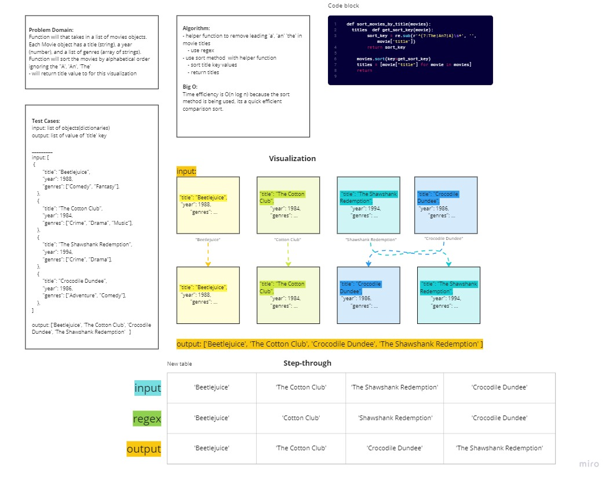

# Movie Sort

Author: Monica Ramirez

## Challenge
Write two functions each function will take in a list of movie objects. Each Movie object has a title (string), a year (number), and a list of genres (array of strings). The one function will sort the the movies by most recent year first and the second function will sort movies by title alphabetically. 

## Whiteboard

## Approach & Efficiency

Big O notation is O(n log n) since both methods use the the sort method. 

## Solution

Loop through list with sort method, and then again to retrive 'title' values in dictionary. The function that sorts the title uses regex to sub out 'A', 'An' and 'The'. The function that sorts by year implements the itemgetter method in sort method so use key 'year'. [Code](https://github.com/mramirez92/data-structures-and-algorithms/blob/main/python/code_challenges/sort_movies.py), [testing](https://github.com/mramirez92/data-structures-and-algorithms/blob/main/python/tests/code_challenges/tests_sort_movies.py)

## Resources
[geeksforgeeks](https://www.geeksforgeeks.org/)

