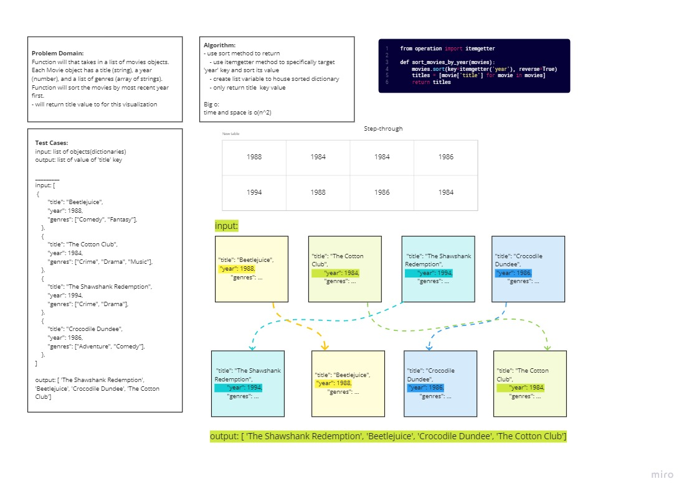

# Movie Sort

Author: Monica Ramirez

## Challenge
Function will that takes in a list of movies objects.
Each Movie object has a title (string), a year (number), and a list of genres (array of strings). Function will sort the movies by most recent year first.

## Whiteboard

## Approach & Efficiency

Big O notation for this method is O of n^2 because it has to loop twice. 

## Solution

Loop through list with sort method, and then again to retrive 'title' values in dictionary. [Code](https://github.com/mramirez92/data-structures-and-algorithms/blob/main/python/code_challenges/sort_movies.py), [testing](https://github.com/mramirez92/data-structures-and-algorithms/blob/main/python/tests/code_challenges/tests_sort_movies.py)

## Resources
[geeksforgeeks](https://www.geeksforgeeks.org/)

